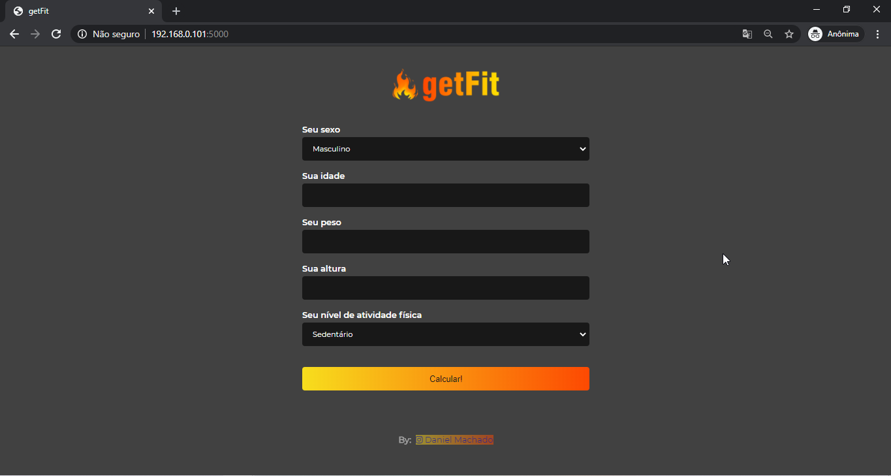
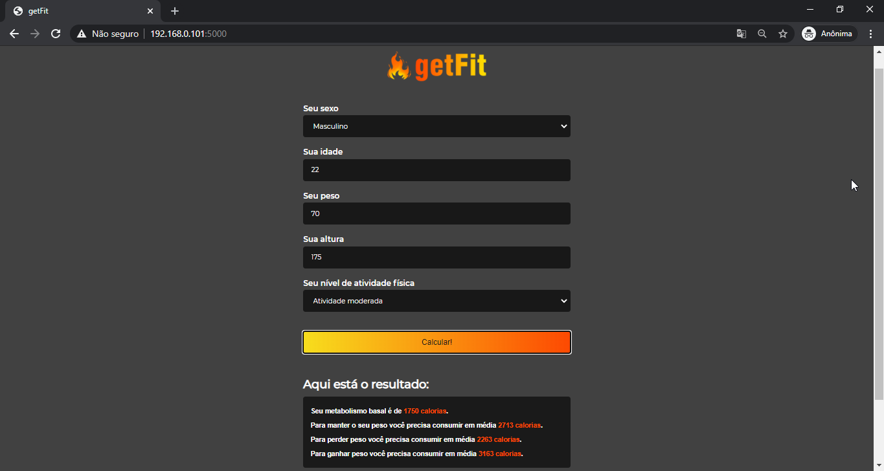

# getFit


## Instalação

Este projeto não precisa de nenhuma depedência para funcionar, porém iremos utilizar o pacote `serve` para roda-lo no browser através de um servidor node.

Sinta-se a vontade caso queira rodar este projeto direto no seu browser clicando com o botão direito no arquivo `index.html` e, em seguida, selecionando a opção `Abrir Com` e selecionando o navegador de sua preferência.

Você precisará ter o [NodeJS](https://nodejs.org) instalado na sua máquina, e, após isso, clonar este repositório.

## Executando a aplicação

Para executá-la é muito simples, basta rodar os seguintes comandos:
```sh
  $ cd getkcal # para acessar a pasta clonada do git
  $ npm init -y # inicializando o package.json
  $ npm install serve -D # instalando o serve como dependência de desenvolvimento
  $ npx serve . # rodando o servidor node
```
Pronto!!

## Imagens do projeto rodando

<div align="center">
    
</div>

<div align="center">
    
</div>